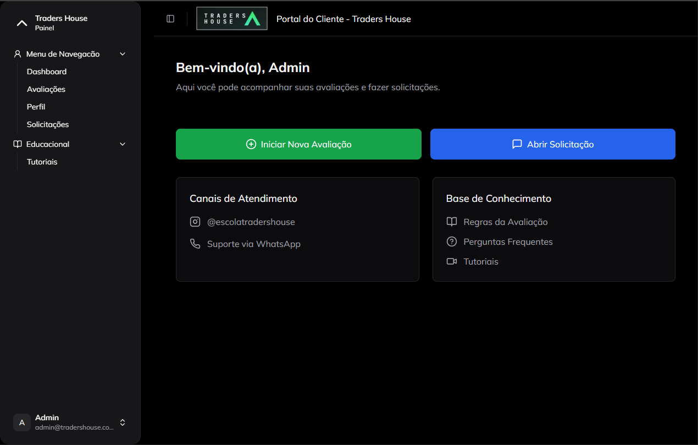
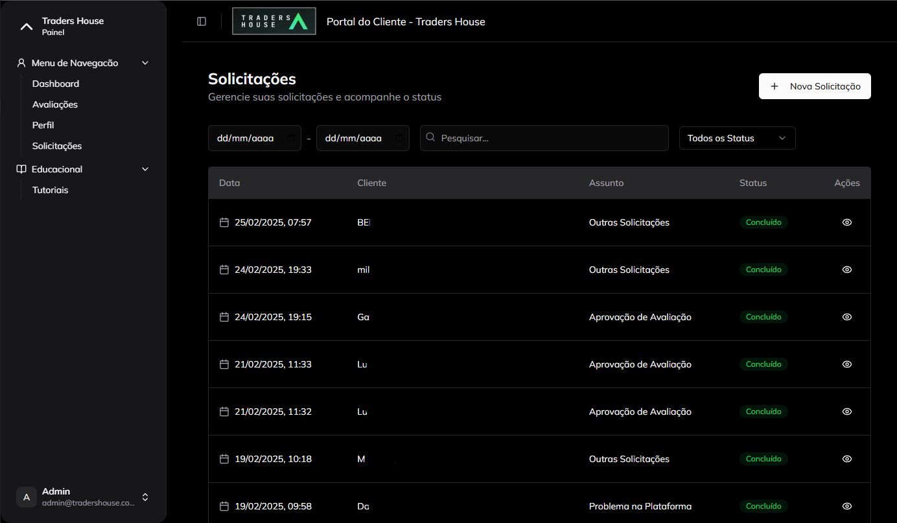
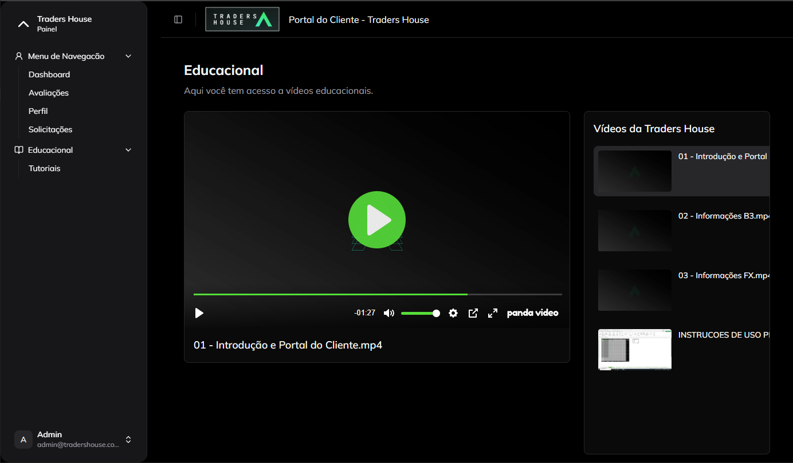

# Client Portal

<div align="center">
  <p>
    
    
    
    
    
  </p>
</div>

## 📋 About the Project

The **Client Portal** is a complete web application for the interface between company and client. Developed with modern technologies, the system allows traders to track their evaluations, view performance metrics, access educational content, and interact directly with the support team.

### ✨ Main Features

- **Secure Authentication**: Complete system with login, registration, password recovery, and session management
- **Personalized Dashboard**: Overview of ongoing evaluations and their progress
- **Evaluation Management**: Detailed tracking of each trading evaluation
- **Request System**: Direct communication channel with the support team
- **Educational Content**: Access to videos and training materials
- **Profile Area**: Management of personal information
- **Responsive Design**: Interface adapted for all devices

## 🖥️ Technologies

The project was built with the following technologies:

- **Frontend**:

  - Next.js 15.1 (App Router)
  - React 18
  - TypeScript
  - Tailwind CSS
  - shadcn/ui (components)
  - Lucide React (icons)

- **Backend**:

  - Prisma ORM
  - NextAuth.js
  - Node.js
  - PostgreSQL
  - REST API

- **Others**:
  - React Hook Form
  - Zod (validation)
  - React Email
  - Nodemailer

## 🏗️ Architecture

- **Next.js App Router**: For routing and rendering
- **Server Components**: For performance optimization
- **Server Actions**: For server-side functions
- **JWT Authentication**: For session management
- **API Routes**: For backend endpoints
- **ORM with Prisma**: For database interaction
- **Middleware**: For route protection and business rules

## 📱 Interface Resources

<div align="center">
  <table>
    <tr>
      <td align="center" width="33%">
        <br/>
        <strong>Secure Login</strong><br/>
        Complete authentication system
      </td>
      <td align="center" width="33%">
        <br/>
        <strong>Dashboard</strong><br/>
        Overview of evaluations and progress
      </td>
    </tr>
    <tr>
      <td align="center" width="33%">
        <br/>
        <strong>Support Center</strong><br/>
        Request and communication system
      </td>
      <td align="center" width="33%">
        <br/>
        <strong>Educational Area</strong><br/>
        Access to videos and content
      </td>
    </tr>
  </table>
</div>

## 🚀 Installation and Usage

### Prerequisites

- Node.js 18+
- PostgreSQL
- Yarn or NPM

### Environment Setup

Clone the repository:

```bash
git clone https://github.com/your-username
cd client-portal
```

Install dependencies:

```bash
npm install
# or
yarn
```

Configure environment variables:

```bash
cp .env.example .env.local
```

Edit the `.env.local` file with your settings.

### Database Initialization

```bash
npx prisma migrate dev
```

### Running the Project

```bash
npm run dev
# or
yarn dev
```

Access the project at [http://localhost:3000](http://localhost:3000)

## 🔒 Security Features

- JWT Authentication
- CSRF Protection
- Password hashing with bcrypt
- Input validation with Zod
- Secure password recovery
- Role-based authorization
- Route protection middleware

## 🧪 Tests

```bash
npm run test
# or
yarn test
```

## 👨‍💻 Author

Developed by Daniel Moura (https://github.com/danielmoura99).

---

<div align="center">
  <p>© 2025 Daniel Moura. All rights reserved.</p>
</div>
